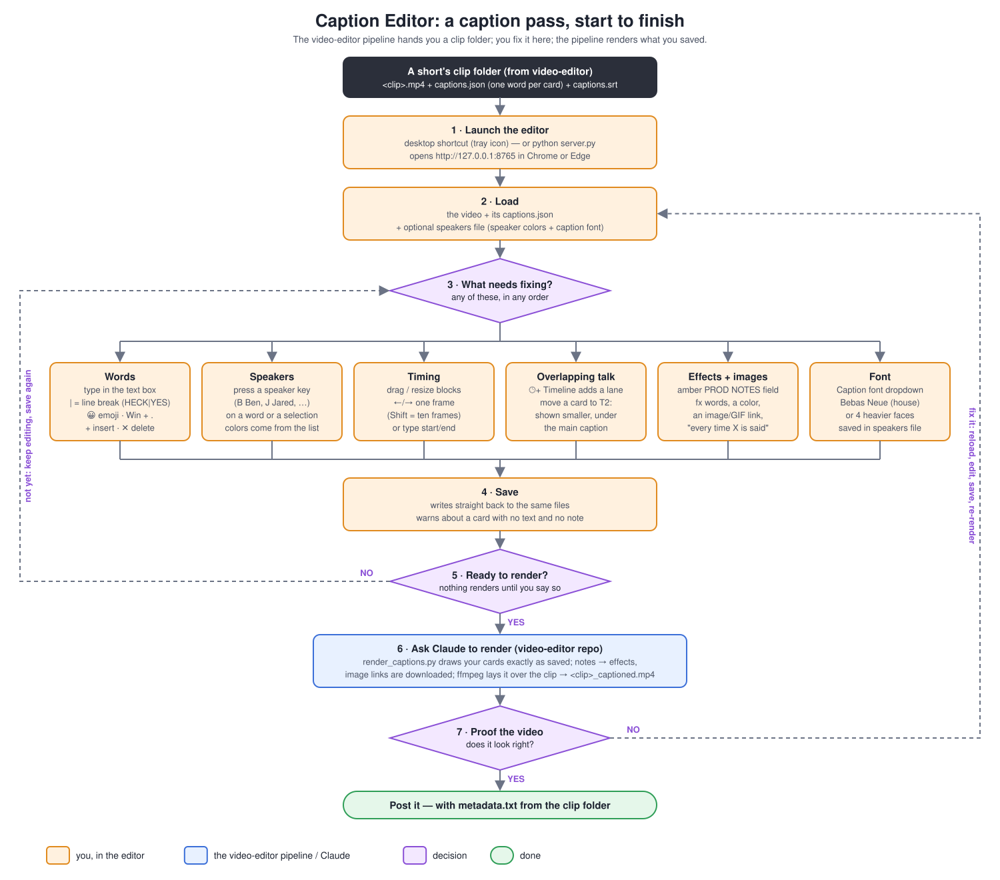

# Caption Editor

A standalone, local browser app for correcting the captions on a short-form
video while you watch it. You can fix who said each word, the text, the
timing and the emoji, and leave instructions for the renderer. There's
nothing to install: Python's standard library serves three static files, and
everything else runs in the browser.

**Companion repo:** [video-editor](https://github.com/benjaminwellssss/video-editor)
([Gitea mirror](https://git.onebynine.ai/ben/video-editor)) is the pipeline
on both sides of this editor. It builds the `captions.json` you load here, and
it renders what you save (`scripts/render_captions.py` + `scripts/caption_fx.py`).
Its [workflow chart](https://github.com/benjaminwellssss/video-editor#readme)
shows where this editor fits in the whole stream → shorts process.



<sub>Also as a PNG: [`docs/workflow.png`](docs/workflow.png). Regenerate with `python docs/make_workflow.py`.</sub>

## The usual pass

1. **Get a clip folder.** The video-editor pipeline writes one per short under
   `E:\Streaming\Videos\CLIPS\<MM-DD-YYYY_GAME>\<clip>\`, containing
   `<clip>.mp4` and `captions.json` (one word per card). The captions come
   either straight from the VOD transcript or, for a hand re-cut, from a
   transcription of the rendered short itself.
2. **Launch.** Double-click the **Caption Editor** desktop shortcut. A tray
   icon starts the server; right-click it for Open / Restart / Quit.
   Alternatively, run `python server.py` and open http://127.0.0.1:8765 in
   **Chrome or Edge**; it needs the File System Access API for native file
   dialogs. `install_shortcut.ps1` recreates the shortcut if the repo moves.
3. **Load** the video, its `captions.json` and, optionally, a speakers file
   (speaker names, keys and colors, plus the caption font).
4. **Fix whatever needs it**, in any order (see the how-tos below).
5. **Save.** This writes straight back to the same files you loaded.
6. **Render.** Ask Claude (in the video-editor repo) to render the captions.
   Your saved cards are drawn **exactly as written**, with no second-guessing.
   Notes become effects, image links are downloaded, and the overlay is
   composited into `<clip>_captioned.mp4` next to the clip.
7. **Proof** the captioned video. If anything is off, reload, fix, save and
   ask for a re-render.

## How-tos

### Fix a word, split a line, add an emoji
Click into the row's text box and type. A `|` makes a **line break**:
`HECK|YES` puts YES on a second line under HECK, and saves as two entries in
`lines`. To add an emoji, use the row's 😀 button, or **Win + .** for
Windows' picker. Use **+** on a row to insert a blank caption after it, **✕**
to delete it, or **+ Add caption** in the header to insert one at the
playhead.

### Tag who's talking
Press a **speaker key** to tag the current word, or a whole selection at
once; the selection then clears. The default keys are B Ben, J Jared, N Noah,
A Brien, M Marlee, K Kat, T Tony and H Mitch. Each speaker's color becomes
the caption fill. Edit or add speakers (name, key, color) in the speakers
panel; recoloring a speaker recolors all of their words on the next save.

To select several words, drag the ☰ handle, or click it and Shift-click
another row to extend, or Ctrl-click to add or remove one.

### Fix timing
- **On the timeline:** drag a block to slide it (it snaps to frames; hold
  **Alt** for free movement), or drag its left or right edge to resize it.
- **With the keyboard:** select caption(s), then **←/→** moves them one
  frame and **Shift** moves ten frames. Holding a key counts as a single
  undo step.
- **Exactly:** type the start/end seconds into the row.

### Show two people talking at once
**🕒+ Timeline** adds a lane. Move the second speaker's cards onto it by
dragging a block down, using **↑/↓**, or picking from the row's **T1/T2…**
menu. **Timeline 1 is the big main caption**; each further timeline is drawn
smaller, stacked underneath. The live preview shows the same thing.

### Add an effect, a color, or an image
Write it in plain English in the row's amber **PROD NOTES** field. Notes are
**never shown** in the video. The renderer understands:

| Write | Get |
|---|---|
| `grow`, `bigger`, `swell` | the caption scales up slowly across the card |
| `zoom`, `punch`, `pop`, `slam` | a fast punch-in |
| `shake`, `rumble` / `vibrate`, `jitter` | position jitter (shake is bigger and also rocks) |
| `dance`, `bounce`, `wiggle` | a smooth bob |
| `glow`, `shine`, `holy`, `neon` | a radiant flash behind the text |
| `red`, `green`, `blue`, `yellow`, `orange`, `purple`, `pink`, `white`, `black`, `cyan` | overrides that card's text color |
| `gentle` / `very` / `extremely` / `violent` / `max` | intensity: ×0.5 / ×1.3 / ×1.5 / ×2 / ×3 |
| `progressively more …` | ramps the effect up across this and the following cards |
| an image or GIF link | shows it for that card's duration. Position words: `top left`, `dead center`, `bottom right`, …, or `above`/`below` the caption. `until the end` keeps it up to the end of the video. |
| `make all instances of "X" shake` / `every time X is said …` | applies to every card with that word |
| `near the bottom`, `under my face` … `centered again` | moves the caption text itself from this card onward (for full-facecam stretches) |

A card with **no text but a note** is allowed. It drives an image or effect
with nothing drawn on screen. The renderer reports anything it can't
understand as `NOT UNDERSTOOD` instead of silently dropping it, so a one-off
instruction ("photo zooms 500×, vibrating and turning red") gets handled by
hand.

### Pick the caption font
The **Caption font** dropdown under the speakers list sets the font for the
whole job. Bebas Neue is the condensed house style. The other four are
wider, heavier faces picked for legibility at small mobile sizes: Montserrat
Black, Anton, Archivo Black and Poppins ExtraBold. The choice is saved in
the speakers file as `{"font": "...", "speakers": [...]}`. A speakers file
from an older version (a plain array) still loads, and renders in Bebas
Neue.

## Timeline panel reference

The **Timelines** panel above the caption list shows every caption as a
block on a time ruler, colored by speaker, with a red playhead.

- **Scrub:** click or drag on the ruler, or on an empty part of a lane. A
  plain click on a block cues the video to its start.
- **Zoom:** the −/+ buttons, or **Ctrl**+mouse wheel.
- **Choosing the timeline "+ Add caption" uses:** click a timeline's label
  (it turns blue).
- **Removing a timeline:** the **✕** on the last timeline's label removes it,
  and its captions move up one.
- **Moving several captions:** with several selected, dragging any one of
  them moves them all.

## Controls

**Space** play/pause · **<** / **>** back / forward 5 s · **Enter** restart
(keeps your edits) · **Backspace** undo (when not typing in a box) ·
**Shift+Backspace** redo · **Esc** clear the selection.

**🔒 Following video / 🔓 Free scroll** toggles whether the list follows the
playing word.

Undo and redo keep the last 10 steps.

## File format

`captions.json` is a list of cards:

```json
{ "start": 5.89, "end": 7.31, "lines": ["🍑 KING!!"],
  "speaker": "Jared", "fill": [255, 214, 0, 255],
  "note": "gentle grow and vibrate of the text" }
```

- `fill` (the speaker's color) is rewritten from the speakers file on every
  save.
- `note` appears only on cards that have one.
- `lane` (0-based) is omitted for the main timeline.
- Cards are saved sorted by start time.
- Unknown fields pass through untouched.
- A timeline with no captions on it isn't stored, so it won't come back
  after a reload.

Files from older versions with `*note*` typed into the caption text are
converted to the PROD NOTES field on load.
